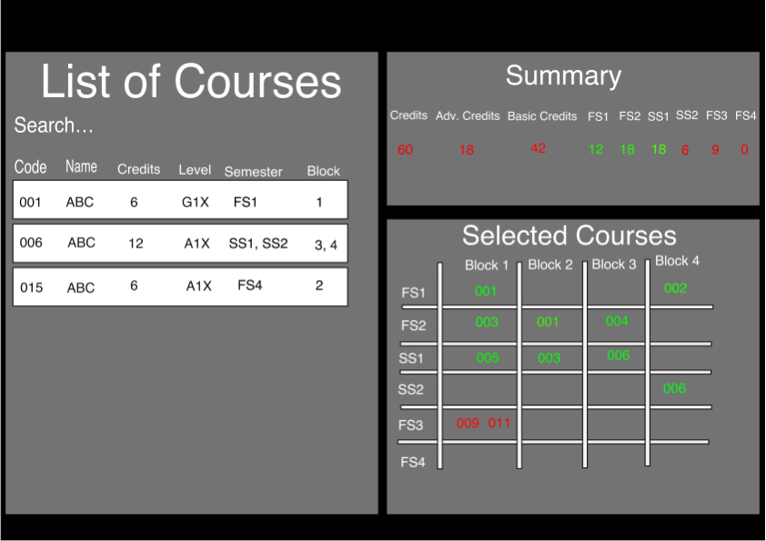

# Screencasts

## Project screencast

https://www.youtube.com/watch?v=PYjJgWbJo80&t=1s

## Individual screencasts

### Robin Andersson

https://www.youtube.com/watch?v=817lGC0iaAY

## Midterm screencast

https://www.youtube.com/watch?v=Ds_lICjioW8

# Heroku links

Login with Google should work with any user, however for Facebook a test user is available with credentials:
email: vbfdmlhiwr_1622795596@tfbnw.net
password: courseplanner

## Production

https://roban591-somgh007-production.herokuapp.com/#/

## Staging

https://roban591-somgh007-staging.herokuapp.com/#/

# Functional and technological specification

## Functional specification

Our idea is a course planner where you can insert courses that you are interested in. Then the course planner gives the
user information, such as if the courses collide (same block and same period) or if the user will not reach the required
amount of credits. The course planner shall also be able to tell the courses if it has selected two similar courses that
have the same content but different course codes, and which cannot be included in the degree.
If time permits we would like to let the user select its master's programme/profile and thus get filtered courses based
on that and also fields that show whether a course is mandatory or elective.
The final extension that we would like to add if time permist is support for multiple semesters so the course planner 
can analyze whether the user has enough credits and whether it has selected all mandatory courses.

The user can sign in to the website using Facebook and Google, and then it will see its list of created course plans 
(if it has any). The left side of the course planner has a list of courses, and a course can then be dragged to a "box"
on the right side of the screen to select the course. Above this box is information presented that shows the amount of
credits. If two courses collide or if they have the same content but different course codes, then they will be marked
red, and some information about this will be displayed.

The top of the website will have a navigation bar that allows the users' to select their profile page or a list
of published course plans by other students so they can see each others' course plans and take inspiration.

Here is an example of the structure of the application, however it includes a suggestion for including all three
semesters in a master's programme/profile (color choice and similar are not set in stone):

## Technological specification

The client framework that we are going to use is Angular, and the server/backend framework is Django with its rest framework. 
We are also going to use Gitlab CI/CD, django's unittes module, and Angular's included test module for initial testing and to
deploy the application to Heroku. If time permits we migh use Selenium for further testing. On heroku we will use PostgreSQL
for the database, while we will use sqlite for local development. We will also use the Thunder Client extension in Visual
Studio Code for initial testing of the server.
